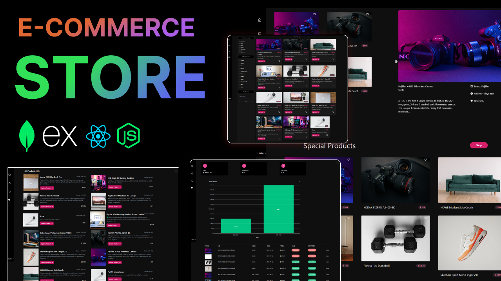

# MERN E-Commerce Store

E-Commerce using MERN Stack. This comprehensive online shopping platform offers a seamless shopping experience for users while providing powerful management tools for administrators.

## Features

- **Product Management**: Admins have the capability to manage products, including adding new products, updating details, and categorizing them for a well-organized storefront.
- **Category Management**: Administrators can easily create, update, and delete product categories to streamline product navigation.
- **User Authentication**: Users can register and log in securely to access personalized features such as favorites, cart, and order history.
- **Shopping Cart**: Users can add products to their shopping cart, review the items, and proceed to checkout.
- **Product Filtering**: Users can filter products by categories, brands, and price input for a tailored shopping experience.
- **Favorites List**: Users can add products to their favorites list for quick access to preferred items.
- **Secure Checkout**: The checkout process is made secure and convenient, allowing users to complete their purchase using PayPal.
- **Order Tracking**: Users can view their order history, and administrators can track total sales through a comprehensive dashboard.

## Technologies Used

- **Frontend**: React.js, tailwindcss, react-redux/reduxjs/toolki
- **Backend**: Node.js and Express.js for server-side development.
- **Database**: MongoDB for efficient data storage.
- **Authentication**: JSON Web Tokens (JWT) for secure user authentication.
- **Payment**: PayPal integration for secure and convenient transactions.

## Screenshot

[Link](https://github.com/chanatinart02/MERN-Stack-E-Commerce-Store/tree/main/screenshot)
